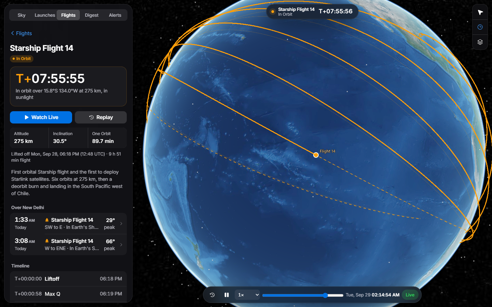
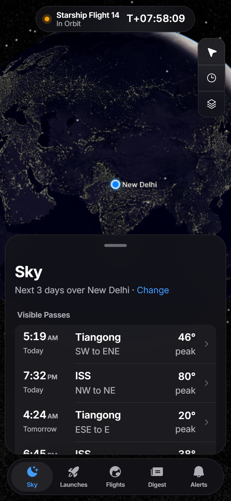

# Orbital

**Know when to look up.** Orbital tells you when the ISS, Tiangong and flights like Starship pass over
your city, and whether you'll actually see them. It shows planned and live orbits on a 3D globe,
counts down to the launches worth watching, and sends a weekly digest.

<p>
  
  
</p>

- **Sky.** The next three days of passes over you, with where to look and a sky chart. A pass counts
  as *visible* only when the satellite is in sunlight and your sky is dark.
- **Flights.** Starship-style flights have no public orbit data before launch. Orbital models their
  path from the hazard zones published for the launch, then places it at the real liftoff time.
  You can replay a flight, or try a different launch time within the window.
- **Launches.** Countdowns from Launch Library 2, with honest dates: when only the day is known,
  it shows the day and no made-up time.
- **Alerts.** Free push notifications through [ntfy](https://ntfy.sh), with no account needed:
  - ten minutes before a bright pass over your city;
  - 60 and 10 minutes before notable launches;
  - once a flight is really up and heading your way.

  Alerts move when a launch slips and disappear if it's scrubbed.
- **Digest.** Every Sunday: what's launching, the best passes over your city and the week's news.
  You can read it on the web or get it by RSS, ntfy, Telegram or email.

There's no server. It's a static site on GitHub Pages plus a few scheduled GitHub Actions jobs.

## How it works

```
CelesTrak, Launch Library 2, Spaceflight News
        │
        ├─ build    every 3 h    → web/data/*.json → the globe (GitHub Pages)
        ├─ alerts   every 3 h    → schedules "ISS over Pune in 10 min" pushes on ntfy
        ├─ watch    every 10 min → launch reminders, liftoff alerts (exits early when nothing is near)
        └─ digest   Sundays      → web/digest/ + ntfy, Telegram, email
```

- **Passes** use SGP4 in both Python (`python-sgp4`) and the browser (`satellite.js`). The tests check
  the Python against [Skyfield](https://rhodesmill.org/skyfield/): rise, peak and set agree to within
  a second. They also check the browser code against the Python, so the site and the alerts always agree.
- **Flight paths** come from a circular orbit with J2 drift that passes over the pad, with modelled ascent
  and descent. For Starship Flight 14 it reproduces [exoplanet5's zone-fitted track](https://github.com/exoplanet5/Starship-IFT14)
  to a mean of 0.15°.
- **Alerts** keep no database. Every ntfy message carries a sequence id, so each run can list what
  it scheduled before, move it or cancel it.

## Run your own

1. In **Settings → Pages**, set the source to **GitHub Actions**. Pages needs a public repository,
   or GitHub Pro for a private one.
2. Edit [`config.yaml`](config.yaml):
   - set `site.url` to your Pages URL;
   - pick a unique `ntfy.topic_prefix`, since anyone can post to a public ntfy topic;
   - add your city.
3. Optionally, add repository secrets:

   | Secret | For |
   | --- | --- |
   | `TELEGRAM_BOT_TOKEN`, `TELEGRAM_CHAT_ID` | Liftoff posts and the digest in a Telegram channel |
   | `SMTP_HOST`, `SMTP_PORT`, `SMTP_USER`, `SMTP_PASSWORD`, `DIGEST_EMAIL_FROM`, `DIGEST_EMAIL_TO` | The digest by email |
   | `NTFY_TOKEN` | An ntfy account, for higher limits |
   | `LL2_TOKEN` | A Launch Library 2 key, for more than 15 requests an hour |

4. In **Settings → Secrets and variables → Actions → Variables**, add `ORBITAL_ENABLED` = `true`.
   The scheduled jobs stay off until you do.
   - **Site** runs every 6 hours: data refresh, pass alerts and deploy.
   - **Launch watch** runs hourly.
   - **Weekly digest** runs on Sundays.

   That is about 1,100 Actions minutes a month, inside the 2,000 free for private repositories.
   Public repositories get unlimited minutes, so you can run them more often there.

## Develop

```sh
python -m venv .venv && source .venv/bin/activate      # Windows: .venv\Scripts\activate
pip install -r requirements-dev.txt
python -m orbital build                                  # fetch data into web/data/
python -m orbital serve                                  # http://localhost:8000
python -m orbital passes pune                            # what's overhead, in the terminal
python -m orbital passes delhi --flight starship-ift14 --all
python -m orbital alerts --dry-run                       # print the pushes instead of sending
python -m orbital watch --dry-run
python -m orbital digest                                 # write this week's digest
```

```sh
npm install
npm test          # browser pass prediction agrees with the Python
npm run smoke     # open the site in headless Chrome, fail on console errors
npm run mobile    # every screen on six phone sizes: no spills, clipping or tiny tap targets
npm run icons     # regenerate web/js/icons.js from Phosphor
npm run vendor    # rebundle satellite.js
python -m pytest  # passes vs Skyfield, flight model, alerts, watcher, digest
```

To add a flight, see [`flights/README.md`](flights/README.md).

## Limits worth knowing

- **Launch Library 2** allows 15 requests an hour without a key. A build uses two or three, and the
  watcher uses none unless a launch is near.
- **ntfy.sh** allows 250 messages a day per IP address. Alerts only go out for high passes: the 16
  default cities needed 19 over two days when this was written.
- **GitHub Actions** can start scheduled runs late. ntfy's scheduled delivery keeps the pushes on time.
  Scheduled workflows in public repositories pause after 60 days without commits; the weekly digest
  commit keeps them running.
- Flight paths are models, not official trajectories.

## Credits

Data from [CelesTrak](https://celestrak.org), and [Launch Library 2](https://thespacedevs.com) and
the Spaceflight News API by The Space Devs. The globe is built with CesiumJS, with NASA Blue Marble
and Black Marble imagery. Icons are by Phosphor. The Starship Flight 14 model is by exoplanet5.
Licenses are in [`THIRD_PARTY_NOTICES.md`](THIRD_PARTY_NOTICES.md). Orbital is MIT licensed.
